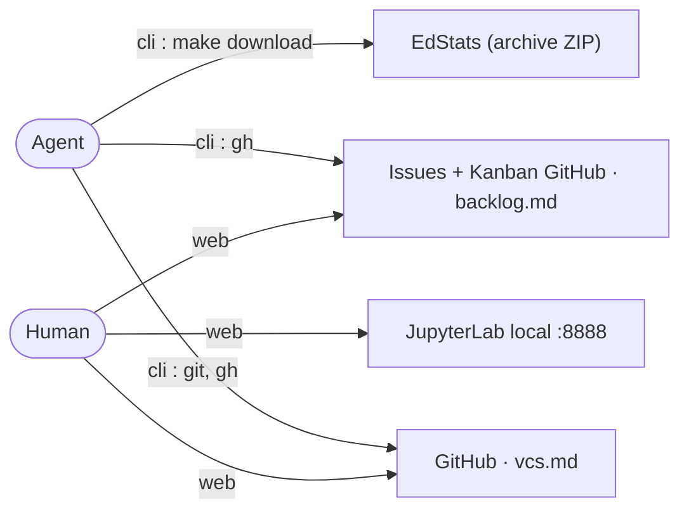

# Ecosystem

```mermaid
flowchart LR
    Human([Human])
    Agent([Agent])
    GH["GitHub · vcs.md"]
    TK["Issues + Kanban GitHub · backlog.md"]
    JLab["JupyterLab local :8888"]
    S3["EdStats (archive ZIP)"]

    Agent -- "cli : git, gh" --> GH
    Human -- web --> GH
    Agent -- "cli : gh" --> TK
    Human -- web --> TK
    Human -- web --> JLab
    Agent -- "cli : make download" --> S3
```
